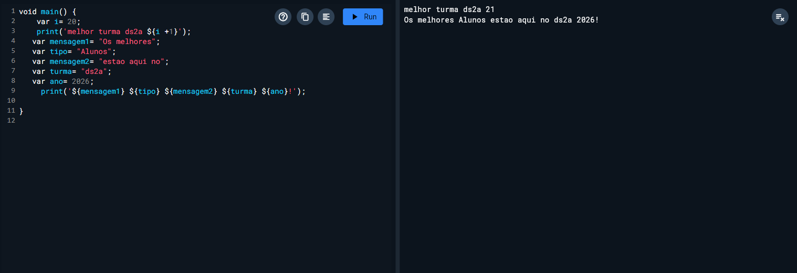

# Meu primeiro Projeto em Dart Flutter

## Professor

Nome: Jansen Killinger cara
Turma: DS2A<br>
Professor: Jansen

Aula de comandos basico em Dart Flutter 

```Dart
   dart run dart-aula1
``` 
## Resultado
```

```
projeto para alunos Senai e Sesi
aula de comando basicos em dart Flutter
